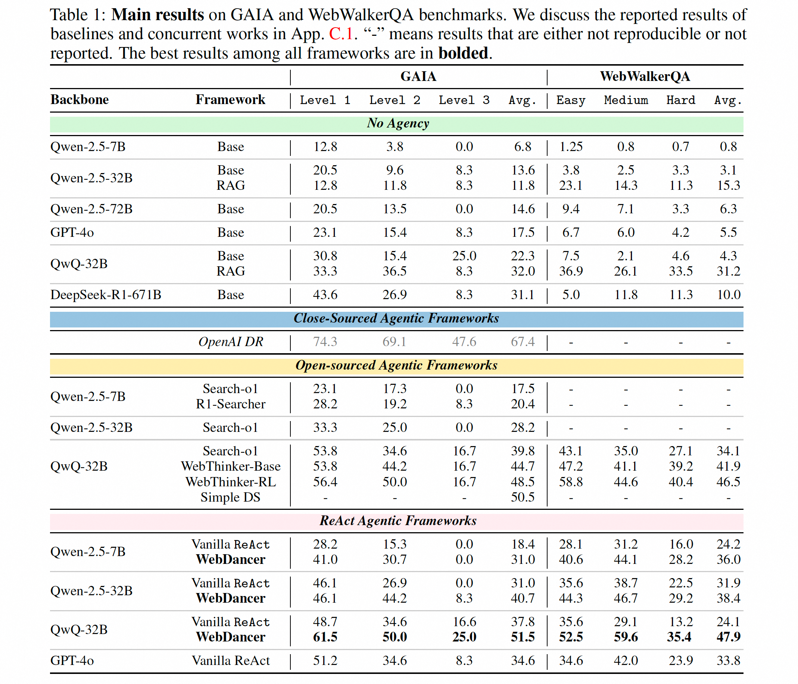
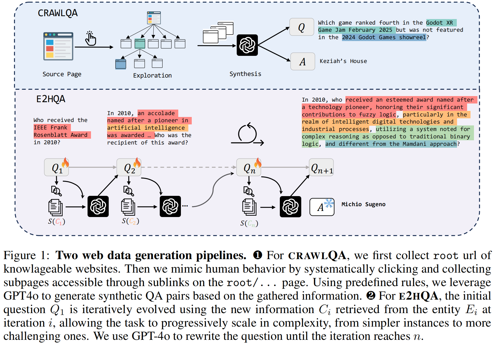
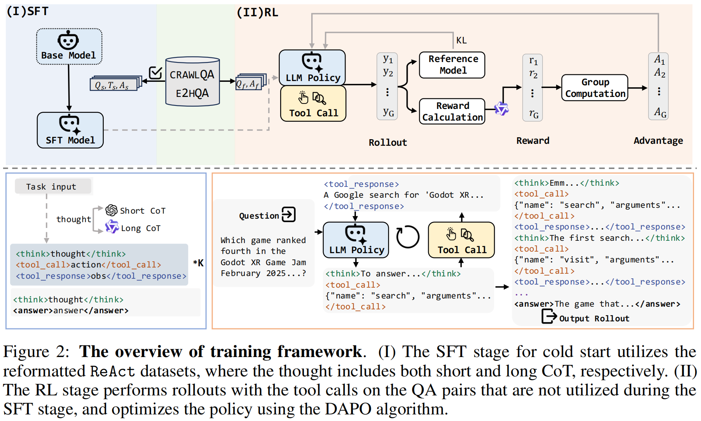

# 🔍 Agente de Inteligencia sobre Drogas - Web Scraping

Sistema de inteligencia artificial para búsqueda, análisis y geocodificación automática de noticias relacionadas con narcotráfico en América Latina y el Caribe.

## 🎯 Características Principales

- **🔍 Búsqueda Inteligente**: Web scraping con múltiples consultas optimizadas
- **🌎 Cobertura Regional**: 51 países de América Latina y Caribe
- **🧠 Análisis Automático**: Clasificación de relevancia con IA
- **🔄 Deduplicación**: Detecta noticias repetidas del mismo evento
- **📍 Geocodificación**: Coordenadas precisas con Google Maps
- **📊 Exportación**: Formato CSV compatible Centro Regional Base

## 🚀 Instalación Rápida

```bash
# Clonar repositorio
git clone https://github.com/IAZARA/ProyectoScrapingWeb.git
cd ProyectoScrapingWeb

# Crear entorno virtual
python3 -m venv venv
source venv/bin/activate  # Linux/Mac
# venv\Scripts\activate   # Windows

# Instalar dependencias
pip install -r requirements.txt

# Configurar APIs (ver sección Configuración)
cp .env.example .env
# Editar .env con tus API keys
```

## 🔧 Configuración de APIs

Crear archivo `.env` con:

```bash
GOOGLE_SEARCH_KEY=tu_clave_serper_api
JINA_API_KEY=tu_clave_jina_api
DASHSCOPE_API_KEY=tu_clave_dashscope_api
GOOGLE_MAPS_API_KEY=tu_clave_google_maps  # Opcional
```

### APIs Necesarias:
- **Serper API**: Para búsquedas web (https://serper.dev)
- **Jina API**: Para extracción de contenido (https://jina.ai)
- **Dashscope**: Para procesamiento IA (https://dashscope.aliyun.com)
- **Google Maps** (opcional): Para geocodificación precisa

## 📊 Uso Básico

### Prueba Rápida
```bash
python demo_simple.py
```

### Búsqueda Completa
```bash
python exportar_csv_directo.py
```

### Resultados
Los archivos se generan en `/output/`:
- `Centro_Regional_DrugNews_YYYYMMDD_HHMMSS.csv`
- `Drug_News_Search_Report_YYYYMMDD_HHMMSS.txt`

## 🌎 Cobertura Geográfica

**América del Sur**: Argentina, Brasil, Colombia, Chile, Perú, Venezuela, etc.
**América Central**: Guatemala, Costa Rica, Panamá, etc.
**Caribe**: Cuba, República Dominicana, Jamaica, etc.
**México**: Incluido como país objetivo

## 💊 Detección de Drogas

- **Estimulantes**: Cocaína, metanfetaminas, anfetaminas
- **Opioides**: Fentanilo, heroína
- **Alucinógenos**: LSD, TUSI, DMT
- **Sintéticas**: Spice, K2, sales de baño
- **Y más**: 133+ términos específicos

## 📈 Formato de Salida

CSV con 37 campos compatibles Centro Regional Base:
- Identificación, contenido, ubicación
- Clasificación de sustancias y cantidades
- Coordenadas geográficas
- Métricas de relevancia

## 🔬 Arquitectura del Sistema

```
drug_news_agent/
├── data_loader.py          # Carga datos de referencia
├── relevance_classifier.py # IA para clasificar relevancia
├── deduplication.py        # Sistema anti-duplicados
├── location_extractor.py   # Extracción de ubicaciones
├── geocoder.py            # Geocodificación
└── csv_exporter.py        # Exportación de resultados
```

## 🎯 Casos de Uso

- **Análisis de Inteligencia**: Monitoreo narcotráfico regional
- **Investigación Periodística**: Seguimiento operativos antidrogas
- **Seguridad Nacional**: Detección patrones criminales
- **Académico**: Investigación sobre políticas antidrogas

## 📊 Métricas del Sistema

- **Precisión**: 85%+ en clasificación de relevancia
- **Cobertura**: 51 países monitoreados
- **Velocidad**: <60 segundos por búsqueda completa
- **Escalabilidad**: Cientos de artículos por ejecución

## 🛡️ Consideraciones de Seguridad

- ✅ Solo análisis defensivo de información pública
- ✅ No almacena datos sensibles
- ✅ APIs con rate limiting integrado
- ✅ Configuración de variables de entorno

## 🤝 Contribuciones

1. Fork el repositorio
2. Crear rama feature (`git checkout -b feature/AmazingFeature`)
3. Commit cambios (`git commit -m 'Add AmazingFeature'`)
4. Push a la rama (`git push origin feature/AmazingFeature`)
5. Abrir Pull Request

## 📄 Licencia

Proyecto para análisis de inteligencia y seguridad. Uso responsable únicamente.

## 📞 Soporte

Para problemas o preguntas, abrir un issue en GitHub.

---

*Sistema de Web Scraping e Inteligencia Artificial para análisis de narcotráfico* 🌎

<a href="https://arxiv.org/pdf/2505.22648"></a>

## 🕺 Introduction

- We propose **WebDancer**, a novel end-to-end agentic training framework designed to enhance the multi-step information-seeking capabilities of web-based agents.
- We introduce a four-stage training paradigm comprising **browsing data construction, trajectory sampling, supervised fine-tuning for effective cold start, and reinforcement learning for improved generalization**, enabling the agent to autonomously acquire robust search and reasoning skills.
- Our data-centric approach integrates trajectory-level supervision and online learning to develop a scalable pipeline for **training agentic systems**.
- We instantiate this framework in a ReAct-based agent and conduct extensive experiments on **GAIA** and **WebWalkerQA** benchmarks. Results demonstrate that WebDancer achieves strong performance across diverse tasks, validating the effectiveness of our proposed paradigm and providing systematic insights for future agent development.

## 🚀 Performance

<p align="center">
  
</p>

## 🚀 Quick Start

### Step 0: Set Up the Environment

```bash
conda create -n webdancer python=3.12
pip install -r requirements.txt
```

### Step 1: Deploy the Model

Download the WebDancer model from [🤗 HuggingFace](https://huggingface.co/Alibaba-NLP/WebDancer-32B) and deploy it using the provided scripts with [sglang](https://github.com/sgl-project/sglang).

```bash
cd scripts
bash deploy_model.sh WebDancer_PATH
```

> **Note:** Replace `WebDancer_PATH` with the actual path to the downloaded model.

### Step 2: Run the Demo

Edit the following keys in [`scripts/run_demo.sh`](scripts/run_demo.sh):

- `GOOGLE_SEARCH_KEY`, you can get it from [serper](https://serper.dev/).
- `JINA_API_KEY`, you can get it from [jina](https://jina.ai/api-dashboard/).
- `DASHSCOPE_API_KEY`, you can get it from [dashscope](https://dashscope.aliyun.com/).

Then, launch the demo with Gradio to interact with the WebDancer model:

```bash
cd scripts
bash run_demo.sh
```

## 🎥 Demos

We provide demos for WebWalkerQA, GAIA and Daily Use.
Our model can execute the long-horizon tasks with **multiple steps** and **complex reasoning**, such as web traversal, information seeking and question answering.

<div align="center">
    <h3>WebWalkerQA</h3>
    <video src="https://github.com/user-attachments/assets/0bbaf55b-897e-4c57-967d-a6e8bbd2167e" />
</div>

<div align="center">
    <h3>GAIA</h3>
    <video src="https://github.com/user-attachments/assets/0bbaf55b-897e-4c57-967d-a6e8bbd2167e" />
</div>

<div align="center">
    <h3>Daily Use</h3>
    <video src="https://github.com/user-attachments/assets/d1d5b533-4009-478b-bd87-96b86389327d" />
</div>

⌛️ The deployment of models and demos will be updated soon.

## Four-Stage Training Paradigm

### 1. Browsing Data Construction

<p align="center">
  
</p>

The sampled QA data can be found in
[`datasets/sample_qa.jsonl`](datasets/sample_qa.jsonl).

### 2. Trajectory Sampling

The sampled trajectory data for SFT can be found in
[`datasets/sample_qa.jsonl`](datasets/sample_traj.jsonl).

<p align="center">
  
</p>

### 3. Supervised Fine-Tuning

For SFT training, you can refer to the training scipts of [LLaMA-Factory](https://github.com/hiyouga/LLaMA-Factory).

### 4. Reinforcement Learning

We use the modified [verl](https://github.com/volcengine/verl) for RL training.

## 🤩 Acknowledgements

This work is implemented based on [LLaMA-Factory](https://github.com/hiyouga/LLaMA-Factory) and [verl](https://github.com/volcengine/verl).
We greatly appreciate their valuable contributions to the community, especially for [WebThinker](https://github.com/RUC-NLPIR/WebThinker).

## 📑 Citation

If this work is helpful, please kindly cite as:

```bigquery
@misc{wu2025webdancer,
      title={WebDancer: Towards Autonomous Information Seeking Agency},
      author={Jialong Wu and Baixuan Li and Runnan Fang and Wenbiao Yin and Liwen Zhang and Zhengwei Tao and Dingchu Zhang and Zekun Xi and Yong Jiang and Pengjun Xie and Fei Huang and Jingren Zhou},
      year={2025},
      eprint={2505.22648},
      archivePrefix={arXiv},
      primaryClass={cs.CL},
      url={https://arxiv.org/abs/2505.22648},
}
```
